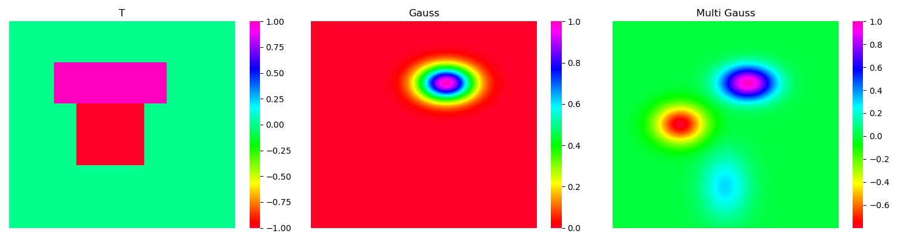

# IMSP_MUMPS_Solver
MUMPS Solver for the following 2D Inverse medium scattering problem(**IMSP**)  
  
<div align=center>

</div>

- $\phi_0$ : total field
- $\phi^i$ : inident field
- $\psi$ : scattered field
- $q$ : scatterer, with compact support in $\mathbb{R}^2$  
## Boundary Condition
**Summerfield Radiation Condition**  

<div align=center>

</div>  

Reduce the problem by an artificial surface: [First-order Absorbing Boundary Condition](https://www.math.purdue.edu/~lipeijun/paper/2005/Bao_Li_IP_2005.pdf)  

<div align=center>

</div>

## Forward problem
For fixed $\phi^i,q,k$  

<div align=center>

</div>

Induce  


<div align=center>

</div>

## Inverse problem
Determine the scatter $q(x)$ from the measurements of $\psi|_{\partial \Omega}$  
### Incident Wave (plane wave)

<div align=center>

</div>

Uniformly, Define $\phi^i$ from $m$ different angles:  

<div align=center>

</div>

### Optimization Model

<div align=center>

</div>

- $M$ : the matrix to generate $\psi|_{\partial \Omega}$ from $\psi$
- $q_t$ : the ground truth of the scatterer $q$
- $\operatorname{Data}(q_t)$ : $\psi|_{\partial \Omega}$ aroused by $q_t$

## Method
- Solve the Forward problem(PDE) by **FDM** to generate the equation and **MUMPS** to solve it
- Derive $\frac{\partial \mathscr{F}_k}{\partial q}$ and $\frac{\partial J}{\partial q}$ through **functional analysis** 
- Use **L-BFGS** to solve the total optimization problem

## Scatterer
<div align=center>

</div>

## Parameters
- k : the frequency of the incident wave
- m : the number of incident angles
- maxq : the strength of the scatterer
- nosielevel : the nosie level of the collected boundary data  
We use a grid of 64 on $[0,1]^2$ to discrete the problem. The Initial gauess of $q$ is zero.  
As for **L-BFGS**, we set ```gtol = 1e-10``` and ```maxiter=50```.
## Usage
- [MUMPS Install](https://github.com/MIA123MIA321/MUMPS-Install)
- ```bash scripts/xxx.sh```
## Results
- iter : iter after iteration termination
- $J_0$ : initial value of $J$
- rel-J : $J_{res}$ / $J_0$
- rel-err : relative error between $q_{res}$ and $q_t$ after iteration termination
- time : time per iter after iteration termination


### T shape
| k | m | maxq | noise | iter | $J_0$| rel-J |rel-err | time |
|:-----:|:----:|:----:|:----:|:----:|:----:|:----:|:----:|:----:|
|**80**|**64**|**0.1**| **0%**|**50**|**1.71e2**|**5.28e-7**| **8.61%** | **4.77** |
|**10,20,40,60,80**| | | | |**3.13e2**|**6.16e-7**|**8.63%** |**19.27**|
|**40,60,80**| | | | |**2.99e2**|**6.07e-7**|**8.62%**|**12.59**|
|**60,80,100**| | | | |**6.01e2**|**5.28e-8**|**1.05%**|**12.61**|
| |**16**| | | |**1.72e2**|**1.93e-5**|**13.70%**|**1.18**|
| |**32**| | | |**1.71e2**|**1.00e-6**|**8.65%**|**2.14**|
| |**128**| | | |**1.71e2**|**4.86e-7**|**8.61%**|**8.54**|
| | |**0.01**| | |**2.15e1**|**4.39e-7**|**9.48%**|**5.71**|
| | |**0.3**| | |**1.74e2**|**5.72e-2**|**154.17%**|**5.44**|
| | |**0.5**| | |**5.62e2**|**1.98e-1**|**138.90%**|**5.38**|
| | |**0.7**| | |**4.84e1**|**1.35e-1**|**116.30%**|**5.62**|
| | |**1.0**| | |**3.47e1**|**1.39e-1**|**113.09%**|**5.52**|
| | | |**0.1**| |**1.75e2**|**2.57e-2**|**25.75%**|**5.75**|
| | | |**0.3**| |**2.14e2**|**1.87e-1**|**71.51%**|**5.44**|
| | | |**0.5**| |**2.91e2**|**3.81e-1**|**134.54%**|**5.43**|

